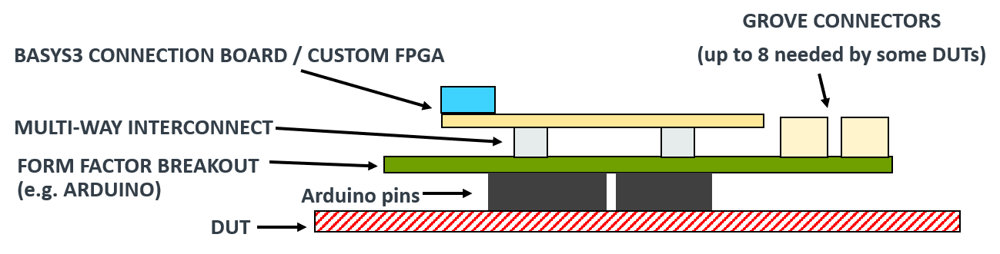
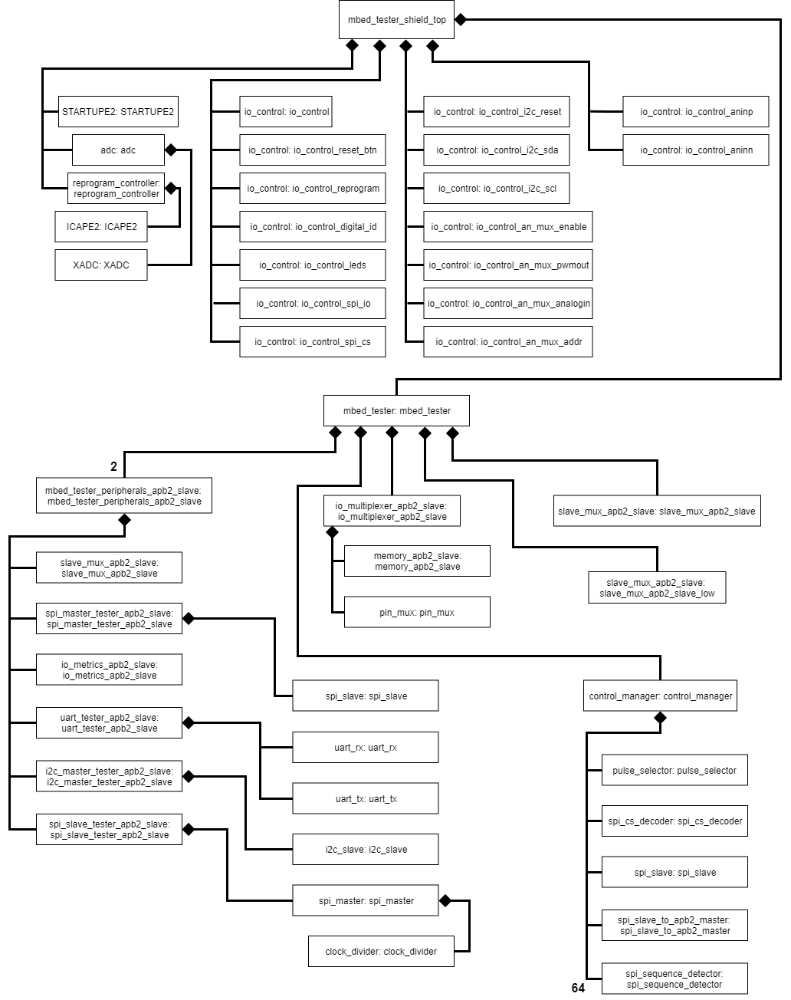
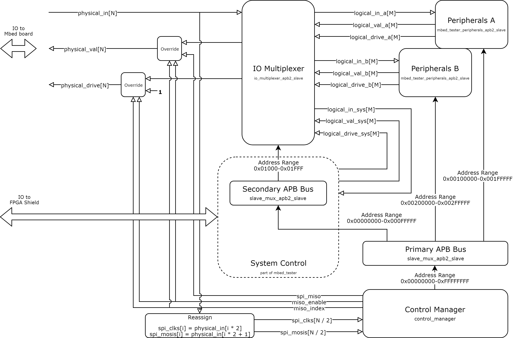
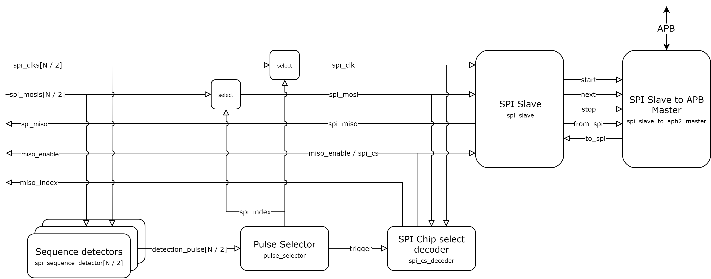
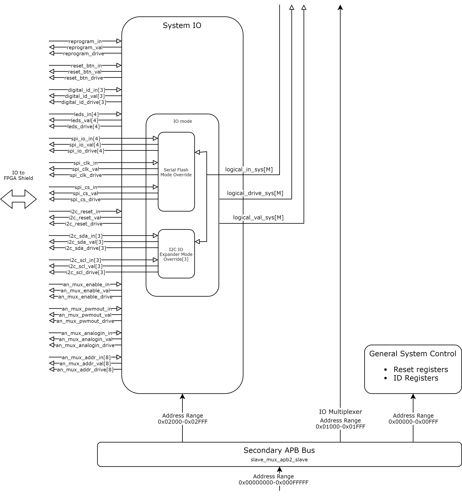
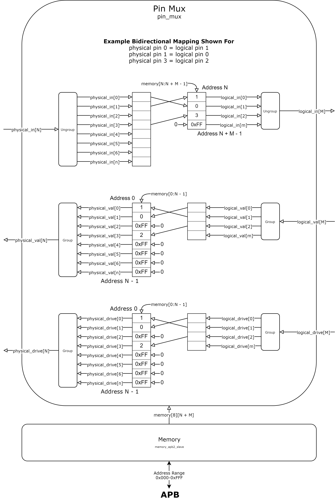
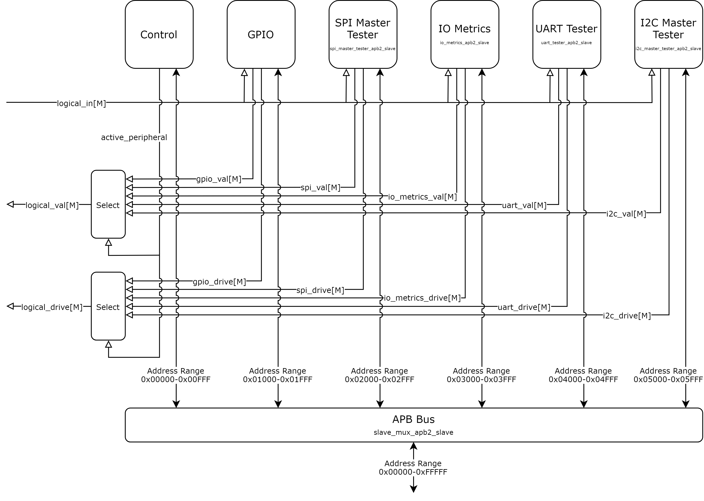
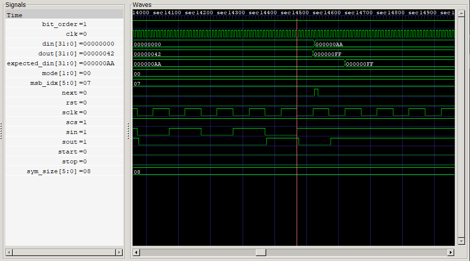
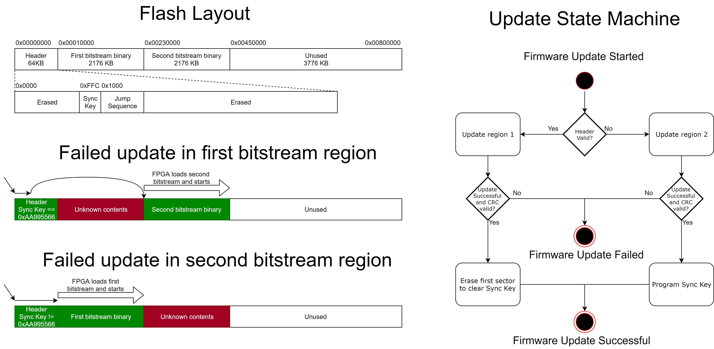

# FPGA CI Test Shield design document

# Table of contents

1. [FPGA CI Test Shield design document](#fpga-ci-test-shield-design-document).
1. [Table of contents](#table-of-contents).
    1. [Revision history](#revision-history).
1. [Introduction](#introduction).
    1. [Overview and background](#overview-and-background).
    1. [Requirements and assumptions](#requirements-and-assumptions).
1. [Detailed design](#detailed-design).
    1. [Hardware design](#hardware-design).
    1. [RTL design](#rtl-design).
        1. [System overview](#system-overview).
        1. [Control Manager](#control-manager).
        1. [System Control](#system-control).
        1. [IO Multiplexer](#io-multiplexer).
        1. [Peripheral Bank](#peripheral-bank).
        1. [Addressing scheme](#addressing-scheme).
        1. [Testing and Simulation](#testing-and-simulation).
    1. [Software design](#software-design).
        1. [Form factor](#form-factor).
        1. [MbedTester](#mbedtester).
        1. [Peripheral Testers](#peripheral-testers).
        1. [Greentea Testing](#greentea-testing).
        1. [FPGA Firmware Update](#fpga-firmware-update).

### Revision history

1.0 - Initial revision - Russ Butler - 2/28/2019.
1.1 - Update document to reflect code changes - Russ Butler - 3/31/2019
1.2 - Add Verilog module hierarchy diagram - Michael Coulter - 4/9/2019
1.3 - Update Verilog module hierarchy diagram, add information on SPISlaveTester - Michael Coulter - 5/15/2019

# Introduction

### Overview and background

The goal of the design proposed in this document is to enable testing of HAL APIs which control Mbed physical pins. HAL APIs which make use of physical pins are particularly hard to test due to the following reasons:
 - A physical connection to each pin being tested is required
 - From board to board, peripherals are on different pins
 - Form factor varies from board to board
 - Timing violations from an incorrectly configured peripheral are hard to detect
 - Physical pins often have multiple functionalities


### Requirements and assumptions

The FPGA CI Test Shield design was created with the following requirements in mind:

 - Every pin connected to the test shield must be testable; the test shield must be controllable by two or more sets of pins so when one set is being used in a test, an alternate can be used to control the FPGA.
 - The test shield must be controllable on devices with GPIO support only; Standard peripherals such as I2C, SPI and UART can't be used to control the test shield as some device may not have these connected or available.
 - The test shield must support targets running at 3.3v or 1.8v. Most targets in Mbed OS operate at 3.3v but many also have the ability to operate at 1.8v.
 - The test shield must work with common standard form factors, such as Arduino, Freedom and Morpho.

# Detailed design

### Hardware design

The hardware of the FPGA CI Test Shield consists of two parts - a generic board which holds the FPGA and a form factor adaptor board. An image of this system can be seen below.



The board with the FPGA contains most of the system complexity. It contains an FPGA with 128 IO pins dedicated to testing, circuity to control pullups and pulldowns on these pins and voltage regulation circuity. The 128 IO pins connect to the form factor board via one or more connectors.

The form factor board is intended to be a low cost adaptor board which connects the FPGA board to the device under test. The form factor board is responsible for supplying 5v to the FPGA board and for connecting all testable form factor pins to the FPGA board. This mapping of the 128 IO pins from the FPGA to the form factor pins of the device under test must match the [software form factor mapping](#form-factor).

### RTL design

#### System overview

The project is structured a hierarchy of verilog modules. The top most module, `mbed_tester_<platform>_top.v`, handles platform specific functionality, such as serializing IO and wrapping vendor specific FPGA functionality. Each top module has an instance of and passes the appropriate signals to the platform independent module `mbed_tester.v`. The module `mbed_tester.v` contains all the major subsystems and connects them together. A verilog module hierarchy view of the system is shown below:



The first three levels of modules are described below:

 - `mbed_tester_<platform>_top.v` - Top level module(s). These are the verilog equivalent of a C++ `main` file.  These provide abstraction based on the platform it is targeting. There are 3 platforms supported - `mbed_tester_sim.v` for running verilog simulations of the system,  `mbed_tester_basys3_top.v` for prototyping on Basys3 development kit hardware and `mbed_tester_shield_top.v` for the actual FPGA CI Test Shield.
    - `io_control.v` - The `io_control` module takes bidirectional pins (wires), synchronizes the input from these pins by using two synchronization flip-flops. Output on these pins is also passed through a flip-flop to ensure a glich free output. There an instance of `io_control` for every pin or vector of pins in the design.
    - `mbed_tester.v` - This is the top most platform independent module of the design. It contains all the major subsystems and connects them together.
      - `control_manager.v` - manages communication to and from the FPGA
      - `slave_mux_apb2_slave.v` - maps multiple APB2 slaves to an APB bus
      - `mbed_tester_peripherals_apb2_slave.v` - containing all the peripherals used for testing Mbed boards
      - `io_multiplexer.v` - handles mapping physical to logical pins

A detailed diagram `mbed_tester.v` is shown below. This is the top most platform independent module of the design.



Below is a high level overview of each of the components of this image.

 - `N` is the number of physical IO pins. These are the pins with physical electrical connections to the FPGA. In the Verilog code, each pin consists of 3 separate wires - an `in` pin to read, a `val` pin to output a value and a `drive` pin to select between input and output mode. `N` is set to 128 for this design.
 - `M` is the number of logical IO pins. These are the pins that Verilog peripherals inside the FGPA can make use of. The IO Multiplexer module has the ability to map a logical pin to one of the 128 physical pins. The logical pins are bidirectional and can be read from via the logical_in signal, written to via the logical_val signal or tri-stated with logical_drive. M is set to 8 for this design.
 - There are two identical peripheral banks, one starting at address `0x00100000` and the other at address `0x00200000`. These each have their own set of `M` pins. This allows two peripherals to operate at the same time.
 - All peripherals in a bank share the same `M` logical pins. All peripherals can read from all `M` pins at any time. Only one peripheral, the active peripheral, can write to the pins.
 - Verilog peripherals assign a fixed function to each logical pin they want to use. For example a UART peripheral may assign logical pin 0 to TX, 1 to RX, 2 to CTS and 3 to RTS.
 - A fully reconfigurable bidirectional Verilog multiplexer is used to set the mapping from a physical pin of the FPGA to a logical pin of the FPGA. This allows the peripherals of the FPGA to be arbitrarily mapped to any pin. This can also be used to map logical system pins to any physical pin.
 - All peripherals and the multiplexer are connected to an Arm APB bus. This allows all parts of the system to be controlled by reading from and writing to registers.
 - Communication with the FPGA is done through the physical pins. Communication uses a subset of SPI which can be easily bit-banged using regular GPIO pins. See the Control Manager section for the technical details of the protocol.

#### Control Manager

The Control Manager manages communication to and from the FPGA. Communication is done using SPI mode 0 transfers with a MOSI, MISO and CLK pin. Chip select is not used. The MOSI and CLK pins must be on the same input port, but MISO can be on any pin. Transfers are performed with the following sequence:
  - Activate an input port (MISO and CLK pair) by writing the 8 byte start key
  - Write 1 byte to select the physical pin the FPGA outputs MISO data on
  - Write 1 byte to select the number of transfer following this one
  - Write 4 bytes to select the address of the transfer
  - Write 1 byte to select the direction of the transfer - 1 for write, 0 for read
  - Write or read the desired data over SPI

Table showing a communication sequence and details on it:

|    Description     | Size in bytes |      Verilog Module      | Notes
|:------------------:|:-------------:|:------------------------:|:------------------------:|
| Start Key          | 8             |   spi_sequence_detector  | Key is ``{0x92, 0x9d, 0x9a, 0x9b, 0x29, 0x35, 0xa2, 0x65}``|
| MISO index         | 1             |      spi_cs_decoder      | This the index of the physical pin to use for MISO.|
| Transfer count     | 1             |      spi_cs_decoder      | For a payload of size `X` this should be `X + 5`. This is to account for the transfer address and direction.|
| Transfer address   | 4             | spi_slave_to_apb2_master | This is the little endian address to perform a transfer on.|
| Transfer direction | 1             | spi_slave_to_apb2_master | Set this to 1 for writes and 0 to for reads |
| Payload            | X             | *determined by address*  | Payload to read or write.|

Table showing the mapping between physical pins and input port pins.

|    Physical Pin     |        Function         |
|:-------------------:|:-----------------------:|
|           0         |    Input Port 0 CLK     |
|           1         |    Input Port 0 MOSI    |
|           2         |    Input Port 1 CLK     |
|           3         |    Input Port 1 MOSI    |
|           4         |    Input Port 2 CLK     |
|           5         |    Input Port 2 MOSI    |
|        `i * 2`      |   Input Port `i` CLK    |
|        `i * 2 + 1`  |   Input Port `i` MOSI   |
|          126        |    Input Port 63 CLK    |
|          127        |    Input Port 63 MOSI   |

Below is an image showing the internal connections of the `control_manager` module which manages communication to and from the FPGA.



Communication with the FPGA is done through an input port of the Control Manager. Each input port consists of a SPI CLK pin, a SPI MOSI pin and a `spi_sequence_detector` module. The pins of an input port are input only and operate in SPI mode 0. An input port is activated by sending the `start key` over SPI. When the `spi_sequence_detector` of the port detects the `start key` it outputs a detection pulse. This pulse is received by the `pulse_selector` module which outputs the index the pulse was received on, along with sending its own trigger pulse. This index is used by two selector multiplexers to select the SPI CLK pin and SPI MOSI pin of the port. The trigger pulse activates the `spi_cs_decoder` module which starts listening for data on the newly connected SPI pins.

The `spi_cs_decoder` then listens for the next two SPI bytes. The first byte it receives it records and outputs as the `miso_index`. The second byte it receives is used as a the number of SPI transfers to assert the chip select for. Immediately after the second byte is received chip select is asserted, allowing `spi_slave` to begin receiving and sending data. Chip select is also output from the Control Manager as `miso_enable` so the `mbed_tester` module can use it along with signal `miso_index` and `spi_miso` to output a MISO signal on the right pin.

When `spi_cs` is asserted, the `spi_slave` module then activates which in turn activates the `spi_slave_to_apb2_master` module. The `spi_slave_to_apb2_master` module reads the next 4 SPI bytes as the little endian address to read from. The next byte is used for the direction of the transfer, 1 to write data to the bus and 0 to read data from the bus. All subsequent bytes then either cause data to be sent or received of the APB bus. The transfer ends when `spi_cs_decoder` has received the correct number of transfer and deasserts chip select.

#### System Control

System Control registers are mapped to address `0x00000000` and are located in the module `mbed_tester`. These registers provide the following functionality:

 - ID and version registers
 - FPGA self reset
 - IO Multiplexer control (See the section [IO Multiplexer](#io-multiplexer) for more information)
 - Input from and output to all system IO pins
 - IO modes
    - Firmware update mode which connects the serial flash SPI pins to the IO Multiplexer
    - IO expander control mode which connects the IO expander I2C pins to the IO Multiplexer.

A diagram the System Control portion of `mbed_tester` is shown below:



#### IO Multiplexer

The IO Multiplexer module handles mapping signals between the `N` physical pins and the `M` logical pins of the FPGA. For every mapping made, three signals need to be connected, `in` which is the input value from a physical pin, `val` which is the value to output on a physical pin and `drive` which sets whether a physical pin is an input or an output. A diagram of these connections is shown below.



Every physical pin and every logical pin has a memory mapped byte to control the pin it is connected to. For a physical pin, this byte selects the logical pin it is connected to by controlling both the `val` and `drive` multiplexers. For a logical pin, this byte selects the physical pin it is connected to by controlling the `in` multiplexer. Physical pins are mapped starting at offset address 0 and logical pins are mapped starting immediately after the last physical pin. A table showing this mapping is shown below:

|    Memory Offset    |                  Function                  |
|:-------------------:|:------------------------------------------:|
|           0         | Logical pin # to connect to physical pin 0 |
|           1         | Logical pin # to connect to physical pin 1 |
|           2         | Logical pin # to connect to physical pin 2 |
|           3         | Logical pin # to connect to physical pin 3 |
|           4         | Logical pin # to connect to physical pin 4 |
|           5         | Logical pin # to connect to physical pin 5 |
|           6         | Logical pin # to connect to physical pin 6 |
|           n         | Logical pin # to connect to physical pin n |
|         N + 0       | Physical pin # to connect to logical pin 0 |
|         N + 1       | Physical pin # to connect to logical pin 1 |
|         N + 2       | Physical pin # to connect to logical pin 2 |
|         N + m       | Physical pin # to connect to logical pin m |

#### Peripheral Bank

Peripherals are added to the system by instantiating them in the module `mbed_tester_peripherals_apb2_slave` and hooking it up. Each peripheral is connected to the APB bus, and connected to all `M` logical pins. All peripherals can read from all logical pins at any time. Only one peripheral, the active peripheral can output data on the logical pins. A diagram of how `mbed_tester_peripherals_apb2_slave` is wired is shown below:



#### Addressing scheme

The addressing map of the system has 3 tiers. For a given address of `0xAAABBCCC`, the `AAA` portion of the address is the first tier, `BB` the second and `CCC` the third. The top tier breaks the address space into 4096 regions (12 bits) of size 0x100000 (20 bits). The top tier uses three of these regions, one for System Control, one for Peripheral bank A and one for Peripheral bank B. In the second tier, each peripheral bank then splits its own address space into 256 regions (8 bits) of size 0x1000 (12 bits) and assigns a region for each peripheral. In the third tier, a peripheral maps its registers to its address space of size 0x1000.

Layout of memory regions:

 - 32 bit address space, split into 12 bit region select, 20 bit region
    - Region 0 - System Control, split into 8 bit region select, 12 bit region
        - Region 0 - 0x00000000 Common Control
        - Region 1 - 0x00001000 IO Multiplexer
        - Region 2 - 0x00002000 System IO
    - Region 1 - Peripherals A, split into 8 bit region select, 12 bit region
        - Region 0 - 0x00100000 Control
        - Region 1 - 0x00101000 GPIO
        - Region 2 - 0x00102000 SPI Master Tester
        - Region 3 - 0x00103000 IO Metrics
        - Region 4 - 0x00104000 UART Tester
        - Region 5 - 0x00105000 I2C Master Tester
        - Region 6 - 0x00106000 SPI Slave Tester
    - Region 2 - Peripherals B, split into 8 bit region select, 12 bit region
        - Region 0 - 0x00200000 Control
        - Region 1 - 0x00201000 GPIO
        - Region 2 - 0x00202000 SPI Master Tester
        - Region 3 - 0x00203000 IO Metrics
        - Region 4 - 0x00204000 UART Tester
        - Region 5 - 0x00205000 I2C Master Tester
        - Region 6 - 0x00206000 SPI Slave Tester

#### Testing and Simulation

This project relies on heavy use of simulations and test benches both due to the complexity of debugging problems on FPGA hardware and due to the long build time of FPGA images. This allows both quick development iterations and a way to easily debug.

Test benches for this project are located in the `sim` directory and can be run with both `Vivado` and `iverilog`. For convenience, there are batch files in this director which can be used to run testing with `iverilog`.

Example simulation waveform created from `iverilog` and displayed in `GTKWave`:



### Software design

#### Form factor

In the code, a form factor consists of an ordered list of pins. This list of pins provides a mapping between device pins and FPGA pins. The index of a pin in the list corresponds to the physical pin of the FPGA it is connected to.

To support a form factor, a board must both physically have that form factor connector and define all the pins of that form factor. Form factor pins which are not connected must still be defined, and should be set to `NC`.

For example the Arduino form factor is defined as the following:
```C
static const PinName ff_arduino_pins[] = {
    D0, D1, D2, D3, D4, D5, D6, D7,
    D8, D9, D10, D11, D12, D13, D14, D15,
    A0, A1, A2, A3, A4, A5
};

static const PinList ff_arduino_list = {
    sizeof(ff_arduino_pins) / sizeof(ff_arduino_pins[0]),
    ff_arduino_pins
};

const PinList *pinmap_ff_arduino_pins()
{
    return &ff_arduino_list;
}
```

Which gives the following mapping to physical FPGA pins:

|  Arduino Pin | Physical Pin |
|:------------:|:------------:|
|  D0          |  0           |
|  D1          |  1           |
|  D2          |  2           |
|  D3          |  3           |
|  D4          |  4           |
|  D5          |  5           |
|  D6          |  6           |
|  D7          |  7           |
|  D8          |  8           |
|  D9          |  9           |
|  D10         |  10          |
|  D11         |  11          |
|  D12         |  12          |
|  D13         |  13          |
|  D14         |  14          |
|  D15         |  15          |
|  A0          |  16          |
|  A1          |  17          |
|  A2          |  18          |
|  A3          |  19          |
|  A4          |  20          |
|  A5          |  21          |

#### MbedTester

The primary interface to the FPGA is the `MbedTester` class. It contains all the code to communicate with the FPGA. It also provides high level helper functions, such as functions to setup pin multiplexing and to select the currently active peripheral.

Low level functionality provided by `MbedTester`:
 - Automatic and manual selection of control pins
 - An `MbedTester::read` and `MbedTester::write` function to read from and write to the FPGA

High level functionality (build on top of `MbedTester::read` and `MbedTester::write`:
 - Functions to create the mapping between physical pins and logical pins
 - Functions to set the currently active peripheral in banks A and B
 - GPIO peripheral driver allowing pins to be read from and written to
 - IO Metrics peripheral driver allowing timing information on pins to be recorded
 - Functions to reset subsystems of the FPGA
 - Functions to read the FPGA firmware version and upgrade it

#### Peripheral Testers

Peripheral tester classes inherit from MbedTester and provide high level functions for testing their respective peripheral. This typically consists of providing utility functions to configure, start and read the results from internal FPGA registers. Some examples of peripheral tester and the functionality the provide are given below:

 - SPITester
    - Set SPI mode
    - Set bit order
    - Set symbol size
    - Set next transfer to send
    - Get number of transfers received
    - Get checksum of transfers
 - UARTTester
    - Set baudrate
    - Set symbol size
    - Set stop bits
    - Set parity
    - Start/Stop RX/TX
    - Get RX count
    - Get RX checksum
    - Get RX data
    - Get number of parity, framing and stop errors
    - Sent the next TX data
 - I2CTester
    - Get the number of start conditions
    - Get the number of stop conditions
    - Get the number of acks
    - Get the number of nacks
    - Get the number of transfers completed
    - Get the checksum of data received/sent
    - Get the number of device address matches
    - Get the device address
    - Get the last byte sent to slave
    - Get the next byte that will be read from the slave
    - Get the number of writes completed
    - Get the number of reads completed
    - Set the device address
    - Set SDA low or high
    - Set the next byte that will be read from the slave
 - SPISlaveTester
    - Get the number of transfers completed
    - Get the checksum of data received/sent
    - Set the clock mode of the spi_slave module
    - Set bit order during transmission of the spi_slave module
    - Set symbol size used during transmission of the spi_slave module
    - Set full-duplex/half-duplex transmission mode of the spi_slave module
    - Set tx/rx symbol count
    - Set divisor to generate spi clock from FPGA base clock (100 MHz)
    - Set number of symbols to be transmitted by spi master
    - Set delay in us between start request and start of transmission
    - Set delay in ns between transmission of successive symbols
    - Request transmission start from FPGA master

#### Greentea Testing

Testing makes use of the FPGA CI Test Shield during testing by first setting up a pin mapping. Then it sets the active peripheral and uses it in the test. Code showing how this is used is below:

```C++
void spi_test_common(PinName mosi, PinName miso, PinName sclk, PinName ssel, SPITester::SpiMode spi_mode, uint32_t sym_size)
{
    uint32_t sym_mask = ((1 << sym_size) - 1);
    // Remap pins for test
    tester.pin_map_reset();
    tester.pin_map_set(mosi, MbedTester::SPIMosi);
    tester.pin_map_set(miso, MbedTester::SPIMiso);
    tester.pin_map_set(sclk, MbedTester::SPISclk);
    tester.pin_map_set(ssel, MbedTester::SPISsel);

    // Initialize mbed SPI pins
    spi_t spi;
    spi_init(&spi, mosi, miso, sclk, ssel);
    spi_format(&spi, sym_size, spi_mode, 0);
    spi_frequency(&spi, 1000000);

    // Configure spi_slave module
    tester.set_mode(spi_mode);
    tester.set_bit_order(SPITester::MSBFirst);
    tester.set_sym_size(sym_size);

    // Reset tester stats and select SPI
    tester.peripherals_reset();
    tester.select_peripheral(SPITester::SPI);

    // Send and receive test data
    uint32_t checksum = 0;
    for (int i = 0; i < TRANSFER_COUNT; i++) {
        uint32_t data = spi_master_write(&spi, (0 - i) & sym_mask);
        TEST_ASSERT_EQUAL(i & sym_mask, data);

        checksum += (0 - i) & sym_mask;
    }

    // Verify that the transfer was successful
    TEST_ASSERT_EQUAL(TRANSFER_COUNT, tester.get_transfer_count());
    TEST_ASSERT_EQUAL(checksum, tester.get_receive_checksum());

    spi_free(&spi);
    tester.pin_map_reset();
}
```

#### FPGA Firmware Update

Periodically, the FPGA firmware will need to be updated to bring in fixes or new features. You can perform an FPGA update through an attached Mbed board with the following process:
 1. Clone the repository `fpga-ci-test-shield-update`
 1. Build and load this code for the Mbed board the FPGA is connected to
 1. Run `update.py` to program the new firmware onto the FPGA -  `python update.py --update fpga_firmware.bin --reload COM5`

For more information on the update program's usage and supported commands, see the readme in the fpga-ci-test-shield-update repository.

The API for loading firmware, which the update program makes use of, is the function `MbedTester::firmware_update`. This function takes an open file handle and programs the contents of this file to the flash that the FPGA boots from. If the file is in the correct format, has a valid CRC and is programmed correctly, then this function will set this as the new FPGA boot firmware and return true. On the next boot of the FPGA, this firmware will be applied. Code can also trigger the firmware to reload immediately by calling `MbedTester::reprogram`.

Firmware update images need to be in the correct format to be properly programmed using the steps above. Binary releases will already be in this format and can be loaded without modification. This format consists of a size field, the bitstream contents and finally a CRC. This format is shown in the table below:

| Field              | Size in bytes | Notes
|:------------------:|:-------------:|:------------------------:|
| Size               | 4             | Size of the bitstream in little endian format. This must be set to the value N |
| Bitstream          | N             | Binary bitstream generated by Vivado |
| CRC                | 4             | CRC32 of the bitstream in little endian format. This CRC does not include the Size field|

The script `post_process_bitstream.py` can be used to create a bitstream in the above format from a raw bitstream. To do this, run the script and specify both the source bitstream and the destination to write the formatted bitstream:

`> python post_process_bitstream.py <source> <destination>`

The FPGA firmware update process is designed to ensure the FPGA is in a bootable state at all times. This is done by having two regions for the FPGA binary bitstream and by always keeping a valid image loaded into one of these regions. The steps the update code performs are as follows:
 1. Determine where the active firmware bank is by examining the header.
 1. Erase and update the inactive firmware bank
 1. Check the CRC of the image programmed
 1. If the CRC is valid, then atomically switch the active firmware bank by updating the header
    - For activating first firmware bank, the first sector in the header region is erased
    - For activating the second firmware bank, the key `0xAA995566` is written to the end of the first sector in the header region. `0xAA995566` is the SPI mode sync word of the FPGA. It causes the FPGA to run the subsequent jump sequence to the second bank during boot.

A diagram of the flash layout, flash in various failed update states and update state machine is shown below:


